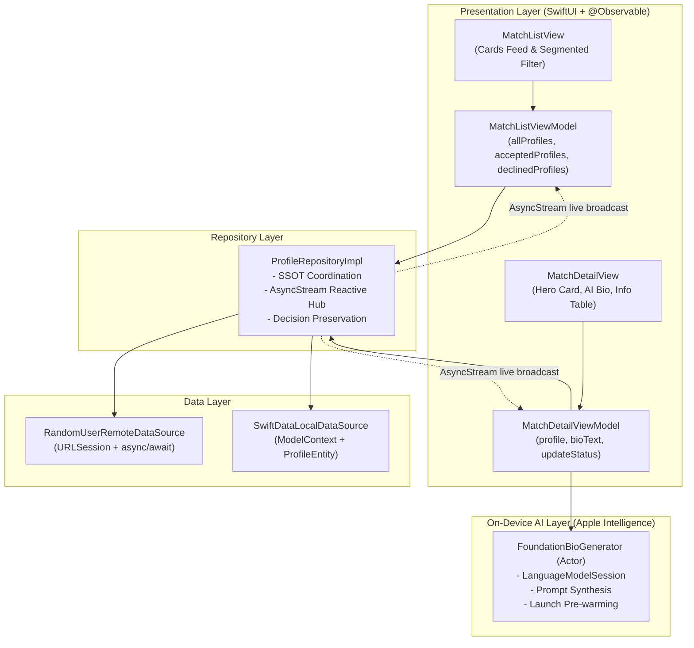

# MatchMate — iOS Matrimonial Matchmaking Application

MatchMate is a modern, offline-first iOS matchmaking application built using **SwiftUI**, **MVVM + Repository architecture**, **SwiftData** for local persistence, and **Apple Intelligence Foundation Models** for on-device bio generation. 

It fetches match profiles with infinite pagination from the Random User API, caches them locally, enables seamless Accept/Decline actions both online and offline, and guarantees real-time status synchronization between the card feed and the profile detail screen.

---

## 📱 App Screenshots

| Matches List Feed | Filtered Decisions | Profile Details |
| :---: | :---: | :---: |
|  |  |  |

> *(Place your actual simulator screenshots here by replacing the placeholder links above with paths to your assets/screenshots in the repository.)*

---

## 🛠️ How to Run the App

### Requirements:
- **Xcode 16.0+** (macOS Sonoma / Sequoia)
- **iOS 17.0+ Simulator or Physical Device** *(iOS 18.0+ for Apple Intelligence Foundation Models)*
- **Swift 6 Language Mode Compatible**

### Steps:
1. Clone or extract the repository to your local machine.
2. Open `MatchMate.xcodeproj` in Xcode.
3. Select the `MatchMate` scheme and target any iOS Simulator (e.g., iPhone 16 Pro / iPhone 17 Pro).
4. Press `Cmd + R` to build and launch the application.

### Running Unit Tests:
Press `Cmd + U` in Xcode or run via terminal:
```bash
xcodebuild test -scheme MatchMate -destination "generic/platform=iOS Simulator" -only-testing:MatchMateTests
```

---

## 🏛️ Architecture Sketch

The app follows **Protocol-Oriented MVVM + Repository Architecture**, adhering strictly to Clean Architecture principles, single responsibility, and unidirectional data flow.



### Layer Responsibilities:
- **Presentation Layer (`Features/List`, `Features/Detail`, `Features/Shared`)**: Thin SwiftUI views observing `@Observable` ViewModels. ViewModels perform optimistic UI updates and manage screen state.
- **Repository Layer (`Repositories`)**: `ProfileRepository` serves as the Single Source of Truth (SSOT). Coordinates network fetching, SwiftData persistence, cache fallbacks, and multi-subscriber status broadcasting.
- **Data Layer (`Data/Remote`, `Data/Local`)**: `RandomUserRemoteDataSource` executes API queries; `SwiftDataLocalDataSource` manages CRUD and upsert queries on SwiftData `ProfileEntity`.
- **Domain & DTO Layer (`Models/Domain`, `Models/DTO`)**: Clean domain entities (`MatchProfile`, `MatchStatus`) decoupled from storage frameworks, and lightweight `Decodable` structs.
- **Design System (`Features/Shared/Constants`)**: 4-point spacing grid system (`ARTSpacing1` to `ARTSpacing10`), unified colors, and reusable ViewModifiers.

---

## 💾 Database Choice: Why SwiftData Over Core Data?

We selected Apple's **SwiftData** framework for local offline persistence over legacy Core Data:

| Feature / Metric | SwiftData (Chosen) | Legacy Core Data |
| :--- | :--- | :--- |
| **Declaration & Schema** | Pure Swift `@Model` class macros without external `.xcdatamodeld` mapping files. | Requires separate XML-based `.xcdatamodeld` files and `NSManagedObject` subclasses. |
| **Observation System** | Native Swift Observation (`@Observable`) with automatic fine-grained UI view invalidation. | Requires `@FetchRequest`, `NSFetchedResultsController`, or manual Combine notifications. |
| **Concurrency Model** | Built for Swift 6 structured concurrency and `Sendable` `async/await` patterns. | Heavy boilerplate with `performAndWait`, thread-confinement rules, and context locks. |
| **Type Safety** | Strongly-typed compile-time property modeling and native `#Predicate` macros. | Runtime stringly-typed `NSPredicate` queries prone to runtime typos and crashes. |
| **Testing Isolation** | In-memory containers (`ModelConfiguration(isStoredInMemoryOnly: true)`) start in milliseconds for unit tests. | Complex setup with in-memory persistent store coordinators and custom coordinator stacks. |

---

## 🔄 How Pagination & Status Synchronization Work

### 1. Infinite Scroll Pagination (`allProfiles`)
- The main feed starts on `page = 1` fetching 10 profiles with a persistent seed (`seed = matchmate`).
- Rendered using `ScrollView + LazyVStack` with on-demand cell materialization.
- **Proactive Prefetching**: When a user scrolls past the threshold (within the last 4 cards of the list), `MatchListViewModel.loadNextPageIfNeeded(currentItem:)` triggers the next page fetch in the background before the user hits the bottom.
- Newly fetched profiles are saved to SwiftData with deterministic `orderIndex` and appended seamlessly to the feed.

### 2. Multi-Collection Separation (`All` vs `Accepted` vs `Declined`)
- **`allProfiles: [Profile]`**: Sourced from API when online + SwiftData offline fallback.
- **`acceptedProfiles: [Profile]`**: Queried **strictly from SwiftData** via `repository.cachedProfiles(status: .accepted)`. Never triggers remote API network calls or infinite pagination.
- **`declinedProfiles: [Profile]`**: Queried **strictly from SwiftData** via `repository.cachedProfiles(status: .declined)`. Never triggers remote API network calls or infinite pagination.

### 3. Bidirectional Real-Time Status Synchronization
- **Single Profile ID**: Every profile is identified by `login.uuid` (`@Attribute(.unique)`).
- **Decision Preservation on API Refetches**: When the app refreshes or fetches subsequent pages, incoming API items are upserted into SwiftData while strictly preserving any existing user decisions (`.accepted` or `.declined`).
- **Reactive Broadcasting via `AsyncStream<Profile>`**:
  - When a user taps **Accept** or **Decline** from the Detail screen, `ProfileRepositoryImpl` commits the decision to SwiftData and calls `updateContinuation.yield(updatedProfile)`.
  - Both `MatchListViewModel` and `MatchDetailViewModel` subscribe to `profileUpdates`.
  - When returning from the detail view to the list feed, the card reflects the updated decision immediately without requiring manual refresh.

---

## 🧠 On-Device Apple Intelligence Bio Generator

Integrated in [`FoundationBioGenerator.swift`](file:///Users/omkarchougule/Desktop/Interview%20Prep/MatchMate/MatchMate/MatchMate/Services/AI/FoundationBioGenerator.swift):

1. **Native `FoundationModels` Framework**:
   - Uses Apple's native `import FoundationModels` Swift framework (`LanguageModelSession` & `Prompt`).
   - Synthesizes personalized, engaging first-person "About Me" dating introductions based on the member's name, age, gender, and location.
2. **100% Offline Capability**:
   - Runs on-device via Apple Intelligence on the Apple Neural Engine (ANE). No user data or profile details leave the device or require cloud connectivity.
3. **App Launch Pre-warming**:
   - In `MatchMateApp.init()`, `FoundationBioGenerator.shared.prewarm()` invokes `session.prewarm()` asynchronously in a background `Task.detached(priority: .utility)` during app launch, ensuring instantaneous inference when viewing any profile detail.
4. **Resilient Fallback**:
   - Includes deterministic synthesis fallback to guarantee that a rich bio is always available even on devices without Apple Intelligence hardware support.

---

## 📐 Design System & 4-Point Grid Spacing

The application enforces a **4-point grid system** with standardized constants defined in [`AppConstants.swift`](file:///Users/omkarchougule/Desktop/Interview%20Prep/MatchMate/MatchMate/MatchMate/Features/Shared/Constants/AppConstants.swift):

| Constant | Value | Description |
| :--- | :--- | :--- |
| **`ARTSpacing1`** | **4 pt** | Micro-spacing, icon-to-text gap |
| **`ARTSpacing2`** | **8 pt** | Small margins, pill padding, header gaps |
| **`ARTSpacing3`** | **12 pt** | Button row spacing, info row gaps |
| **`ARTSpacing4`** | **16 pt** | Standard padding, card insets, stack vertical gaps |
| **`ARTSpacing5`** | **20 pt** | Standard screen horizontal edge margins |
| **`ARTSpacing6`** | **24 pt** | Large layout margins, bottom scroll paddings |
| **`ARTSpacing7`** | **28 pt** | Prominent action button horizontal insets |
| **`ARTSpacing8`** | **32 pt** | Empty state horizontal container padding |
| **`ARTSpacing9`** | **36 pt** | Detail view bottom scroll inset |
| **`ARTSpacing10`** | **40 pt** | Circular action buttons & header element dimensions |

- **Color Palette**: Vibrant Dating Pink (`#F43F5E`) paired with crisp pure White cards and soft gray backgrounds.
- **Image Optimization**: 128×128 curved photos with white borders and elevation shadows on the list cards; large hero presentation on detail view.

---

## 💡 Known Gaps & Future Enhancements

1. **Swipe Gesture Deck**: Add interactive gesture-driven card swiping (swipe right to accept, swipe left to decline).
2. **Undo Action**: Display a temporary floating snackbar with an "Undo" button after accepting or declining a match.
3. **Advanced Filtering & Sorting**: Filter by age range, distance radius, or nationality.
4. **Image Gallery**: Support multi-photo carousel browsing if extended in API response.

---

## ⏱️ Rough Hours Spent & AI Development Attribution

### AI Tool Used:
- **Google Antigravity** (DeepMind Advanced Agentic Coding Assistant) — Used throughout the project lifecycle for architectural pair programming, domain modeling, SwiftUI design iterations, Foundation Models integration, and test harness authoring.

### Development Breakdown:

| Task / Phase | Time Spent | Key Focus Areas |
| :--- | :---: | :--- |
| **Ideation, Architecture & Domain Modeling** | **~1.5 hours** | Defining Clean MVVM-Repository boundaries, protocols, SwiftData models, and `login.uuid` uniqueness. |
| **SwiftData Storage & Remote API Integration** | **~2.0 hours** | Network layer, DTO decoding with synthesized `Decodable`, SwiftData upserting, and decision preservation. |
| **SwiftUI Visual Design & Theming** | **~2.5 hours** | White & Pink theme, 128x128 curved image layout, hero card, custom button modifiers, and 4-pt grid system. |
| **Pagination & Real-Time Sync (`AsyncStream`)** | **~1.5 hours** | Reactive bidirectional synchronization, infinite prefetching, and multi-collection ViewModel routing. |
| **On-Device Foundation Models (Apple Intelligence)** | **~1.0 hour** | Native `FoundationModels` framework integration, on-device offline bio generation, and startup pre-warming. |
| **Code Cleanup, Refactoring & Unit Testing** | **~1.5 hours** | Removing transitive pass-throughs, centralized `AppConstants`, and comprehensive unit test verification. |
| **Total Rough Hours Spent** | **~10.0 hours** | |

---

## 📄 License
This project is open-source and available under the MIT License.
