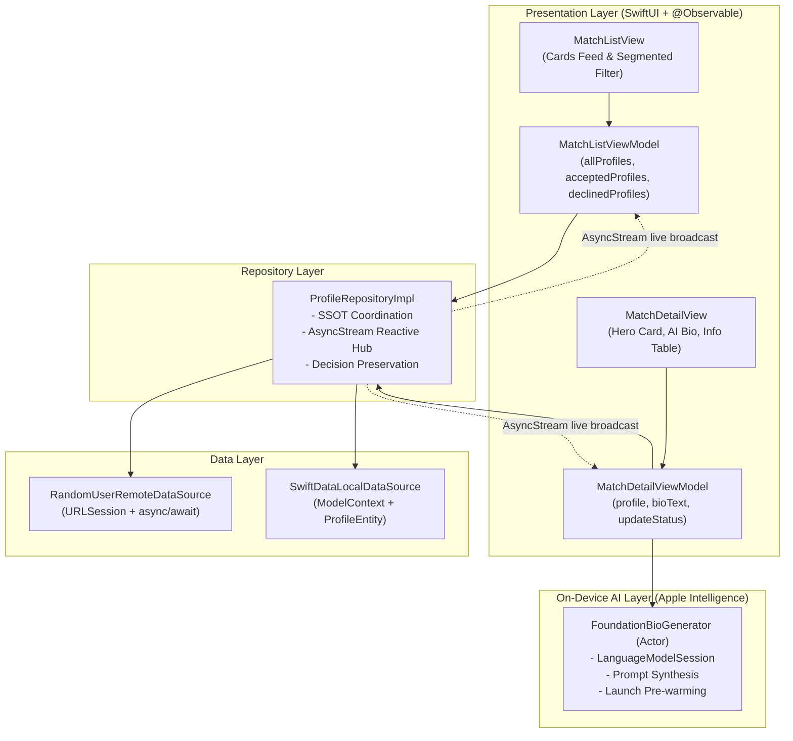

# MatchMate — iOS Matrimonial Matchmaking Application

MatchMate is a modern, offline-first iOS matchmaking application built using **SwiftUI**, **MVVM + Repository architecture**, **SwiftData** for local persistence, and **Apple Intelligence Foundation Models** for on-device bio generation. 

It fetches match profiles with infinite pagination from the Random User API, caches them locally, enables seamless Accept/Decline actions both online and offline, and guarantees real-time status synchronization between the card feed and the profile detail screen.

---


## 📱 App Screenshots

| Matches List Feed | Filtered Decisions | Profile Details |
| :---: | :---: | :---: |
|  |  |  |

| Matches List Feed - Dark Mode | Filtered Decisions - Dark Mode | Profile Details - Dark Mode |
| :---: | :---: | :---: |
|  |  |  |


---

## 🛠️ How to Run the App

### Requirements:
- **Xcode 16.0+** (macOS Sonoma / Sequoia)
- **iOS 17.0+ Simulator or Physical Device** *(iOS 18.0+ for Apple Intelligence Foundation Models)*
- **Swift 6 Language Mode Compatible**

### Steps:
1. Clone or extract the repository to your local machine.
2. Open `MatchMate.xcodeproj` in Xcode.
3. Select the `MatchMate` scheme and target any iOS Simulator (e.g., iPhone 16 Pro / iPhone 17 Pro).
4. Press `Cmd + R` to build and launch the application.

### Running Unit Tests:
Press `Cmd + U` in Xcode or run via terminal:
```bash
xcodebuild test -scheme MatchMate -destination "generic/platform=iOS Simulator" -only-testing:MatchMateTests
```

---

## 🏛️ Architecture Sketch

The app follows **Protocol-Oriented MVVM + Repository Architecture**, adhering strictly to Clean Architecture principles, single responsibility, and unidirectional data flow.



### Layer Responsibilities:
- **Presentation Layer (`Features/List`, `Features/Detail`, `Features/Shared`)**: Thin SwiftUI views observing `@Observable` ViewModels. ViewModels perform optimistic UI updates and manage screen state.
- **Repository Layer (`Repositories`)**: `ProfileRepository` serves as the Single Source of Truth (SSOT). Coordinates network fetching, SwiftData persistence, cache fallbacks, and multi-subscriber status broadcasting.
- **Data Layer (`Data/Remote`, `Data/Local`)**: `RandomUserRemoteDataSource` executes API queries; `SwiftDataLocalDataSource` manages CRUD and upsert queries on SwiftData `ProfileEntity`.
- **Domain & DTO Layer (`Models/Domain`, `Models/DTO`)**: Clean domain entities (`MatchProfile`, `MatchStatus`) decoupled from storage frameworks, and lightweight `Decodable` structs.
- **Design System (`Features/Shared/Constants`)**: 4-point spacing grid system (`ARTSpacing1` to `ARTSpacing10`), unified colors, and reusable ViewModifiers.

---

## 💾 Database Choice: Why SwiftData Over Core Data?

For local offline persistence, we opted for Apple's SwiftData over legacy Core Data to fully embrace modern Swift paradigms. Moving to SwiftData provided several immediate architectural benefits:
### 1. Code-First Schema: 
- We utilize pure Swift @Model macros, removing the overhead of managing XML-based .xcdatamodeld files and legacy NSManagedObject subclasses.
### 2: Native Observation: 
- Seamless integration with Swift's @Observable system gives us automatic, fine-grained UI updates without relying on @FetchRequest or Combine boilerplate.
### 3. Modern Concurrency & Safety: 
- SwiftData is built for Swift 6 structured concurrency (async/await), ditching legacy thread-confinement locks. It also replaces stringly-typed, crash-prone NSPredicates with strongly-typed, compile-time #Predicate macros.

---

## 🔄 How Pagination & Status Synchronization Work

### 1. Infinite Scroll Pagination (`allProfiles`)
- The main feed starts on `page = 1` fetching 10 profiles with a persistent seed (`seed = matchmate`).
- Rendered using `ScrollView + LazyVStack` with on-demand cell materialization.
- **Proactive Prefetching**: When a user scrolls past the threshold (within the last 4 cards of the list), `MatchListViewModel.loadNextPageIfNeeded(currentItem:)` triggers the next page fetch in the background before the user hits the bottom.
- Newly fetched profiles are saved to SwiftData with deterministic `orderIndex` and appended seamlessly to the feed.

### 2. Multi-Collection Separation (`All` vs `Accepted` vs `Declined`)
- **`allProfiles: [Profile]`**: Sourced from API when online + SwiftData offline fallback.
- **`acceptedProfiles: [Profile]`**: Queried **strictly from SwiftData** via `repository.cachedProfiles(status: .accepted)`. Never triggers remote API network calls or infinite pagination.
- **`declinedProfiles: [Profile]`**: Queried **strictly from SwiftData** via `repository.cachedProfiles(status: .declined)`. Never triggers remote API network calls or infinite pagination.

### 3. Bidirectional Real-Time Status Synchronization
- **Single Profile ID**: Every profile is identified by `login.uuid` (`@Attribute(.unique)`).
- **Decision Preservation on API Refetches**: When the app refreshes or fetches subsequent pages, incoming API items are upserted into SwiftData while strictly preserving any existing user decisions (`.accepted` or `.declined`).
- **Reactive Broadcasting via `AsyncStream<Profile>`**:
  - When a user taps **Accept** or **Decline** from the Detail screen, `ProfileRepositoryImpl` commits the decision to SwiftData and calls `updateContinuation.yield(updatedProfile)`.
  - Both `MatchListViewModel` and `MatchDetailViewModel` subscribe to `profileUpdates`.
  - When returning from the detail view to the list feed, the card reflects the updated decision immediately without requiring manual refresh.

---

## 🧠 On-Device Apple Intelligence Bio Generator

Integrated in [`FoundationBioGenerator.swift`](file:///Users/omkarchougule/Desktop/Interview%20Prep/MatchMate/MatchMate/MatchMate/Services/AI/FoundationBioGenerator.swift):

1. **Native `FoundationModels` Framework**:
   - Uses Apple's native `import FoundationModels` Swift framework (`LanguageModelSession` & `Prompt`).
   - Synthesizes personalized, engaging first-person "About Me" dating introductions based on the member's name, age, gender, and location.
2. **100% Offline Capability**:
   - Runs on-device via Apple Intelligence on the Apple Neural Engine (ANE). No user data or profile details leave the device or require cloud connectivity.
3. **App Launch Pre-warming**:
   - In `MatchMateApp.init()`, `FoundationBioGenerator.shared.prewarm()` invokes `session.prewarm()` asynchronously in a background `Task.detached(priority: .utility)` during app launch, ensuring instantaneous inference when viewing any profile detail.
4. **Resilient Fallback**:
   - Includes deterministic synthesis fallback to guarantee that a rich bio is always available even on devices without Apple Intelligence hardware support.

---

## 📐 Design System & 4-Point Grid Spacing

- The application enforces a **4-point grid system** with standardized constants defined in [`AppConstants.swift`](file:///Users/omkarchougule/Desktop/Interview%20Prep/MatchMate/MatchMate/MatchMate/Features/Shared/Constants/AppConstants.swift):
- **Color Palette**: Vibrant Dating Pink (`#F43F5E`) paired with crisp pure White cards and soft gray backgrounds.
- **Image Optimization**: 128×128 curved photos with white borders and elevation shadows on the list cards; large hero presentation on detail view.

---

## 💡 Known Gaps & Future Enhancements

1. **Swipe Gesture Deck**: Add interactive gesture-driven card swiping (swipe right to accept, swipe left to decline).
2. **Undo Action**: Display a temporary floating snackbar with an "Undo" button after accepting or declining a match.
3. **Advanced Filtering & Sorting**: Filter by age range, distance radius, or nationality.
4. **Image Gallery**: Support multi-photo carousel browsing if extended in API response.
5. Introducing **MLX LLM Integration** to find the closest match in terms of location, age and sex and display on the card.

---

## ⏱️ Rough Hours Spent - AI Assisted Development

- It took around 9 - 10 hours of development using the free tier of Claude Code + Google Gemini for AI Assisted development.
---
